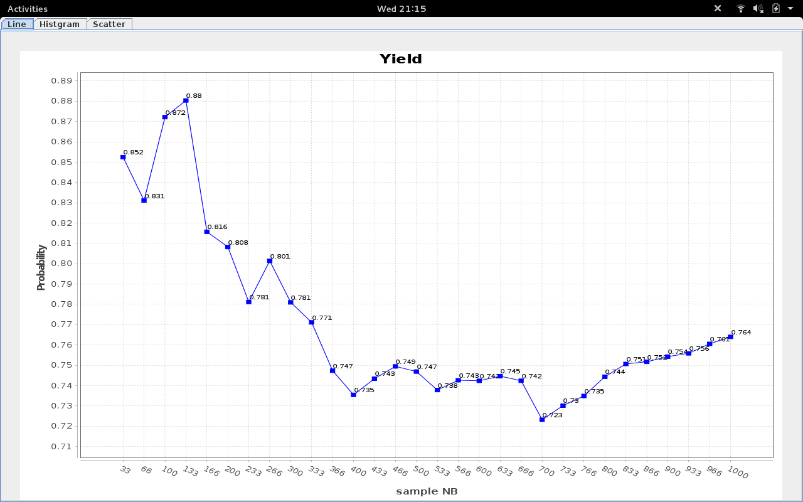
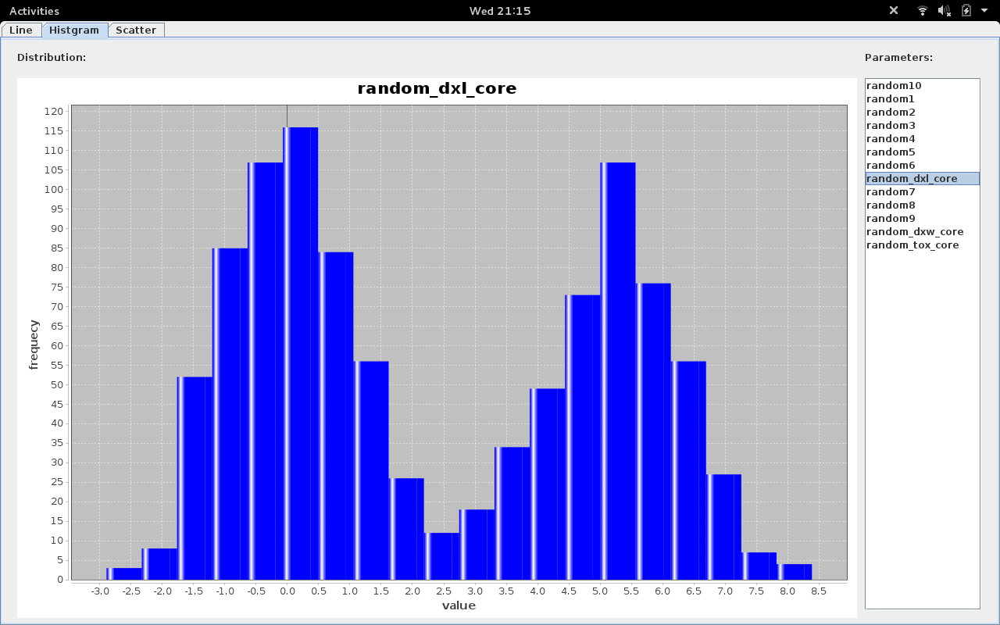
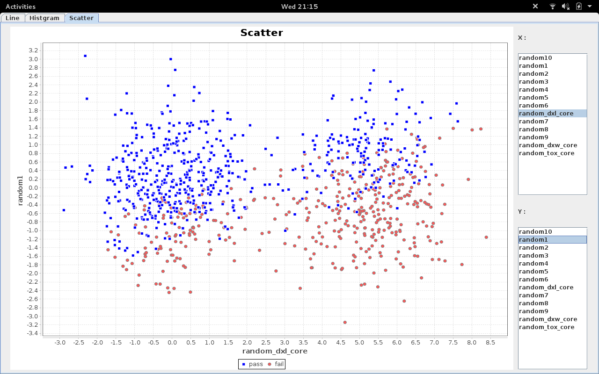

This is a demo of [JFreeChart library](http://www.jfree.org/jfreechart/).

Run:

 - mvn test

or

 - gradle run

 

This demo contains:

 - LineChart

 

 - Histogram

 

 - Scatter

 

 license: Apache License 2.0
